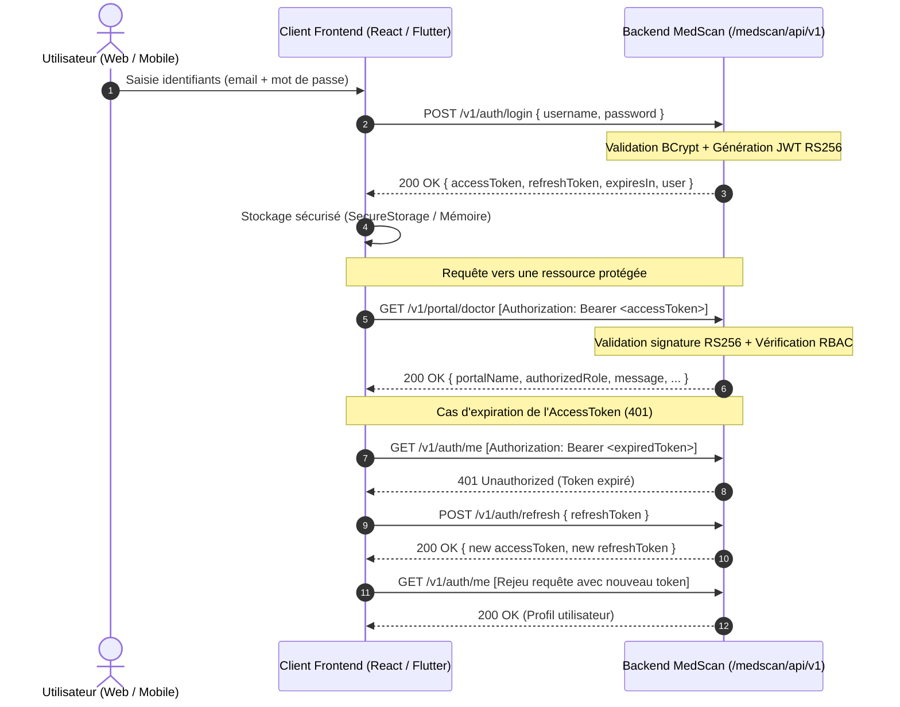

# Guide d'Intégration Frontend & Mobile — MedScan Enterprise

**Statut du document** : `[APPROUVÉ / PRÊT POUR DÉVELOPPEMENT FRONTEND]`  
**Version** : `1.0.0`  
**Date** : 2026-09-26  
**Audience** : Développeurs Frontend Web (React, Next.js, Vue, Angular) & Mobile (Flutter, React Native)  
**Standards Internationaux de Référence** :
- **OpenAPI Specification 3.1.0**
- **RFC 7519** : JSON Web Token (JWT)
- **RFC 6750** : The OAuth 2.0 Authorization Framework: Bearer Token Usage
- **RFC 7807** : Problem Details for HTTP APIs (Gestion standardisée des erreurs)
- **OWASP API Security Top 10** (Stockage sécurisé, rotation des tokens, RBAC)
- **CORS W3C Recommendation**

---

## 1. Informations de Connexion & Environnements

### 1.1 Base URL
Le préfixe standard de l'API est `/medscan/api/v1`.

| Environnement | URL de Base | Description |
| :--- | :--- | :--- |
| **Local (Eclipse)** | `http://localhost:8080/medscan/api` | Serveur local tournant sur la machine de développement |
| **Tunnel Public (Ngrok)** | `https://<votre-id>.ngrok-free.app/medscan/api` | Accès direct HTTPS pour tests immédiats sans déploiement |
| **Recette Cloud (Render/Railway)** | `https://medscan-backend.onrender.com/medscan/api` | Serveur d'intégration continue hébergé en ligne |
| **Production Dédiée** | `https://api.medscan.org/medscan/api` | Infrastructure de production souveraine haute sécurité |

> **Note de tolérance d'URL** : Le backend MedScan intègre un normaliseur d'URL automatique qui tolère indifféremment les requêtes avec ou sans préfixe `/medscan/api` (ex: `/medscan/api/v1/health` ou `/v1/health`).

### 1.2 Configuration des Variables d'Environnement Frontend

#### Pour Web (React / Next.js / Vite) : `.env`
```env
# URL de l'API MedScan (ajuster selon votre cible)
VITE_API_BASE_URL=https://<votre-domaine-ou-ngrok>/medscan/api
VITE_API_TIMEOUT=15000
```

#### Pour Flutter : `lib/config/environment.dart`
```dart
class Environment {
  static const String apiBaseUrl = String.fromEnvironment(
    'API_BASE_URL',
    defaultValue: 'https://<votre-domaine-ou-ngrok>/medscan/api',
  );
  static const int connectTimeoutMs = 15000;
  static const int receiveTimeoutMs = 15000;
}
```

---

## 2. Architecture de Sécurité & Flux d'Authentification

MedScan Enterprise applique une architecture **Zero Trust**. Chaque requête vers une ressource protégée doit fournir un jeton Bearer JWT valide signé en RS256.



---

## 3. Matrice des Acteurs & Comptes de Test (Seed Data)

Tous les comptes ci-dessous sont préconfigurés dans le backend avec le mot de passe : **`Password123!`**

| Rôle | Identifiant / Email | Portail Dédié | Permissions Clés |
| :--- | :--- | :--- | :--- |
| **PATIENT** | `patient@medscan.org` | `/v1/portal/patient` | `health_record:read`, `prescription:read` |
| **DOCTOR** | `doctor@medscan.org` | `/v1/portal/doctor` | `patient:read`, `consultation:write`, `prescription:write` |
| **PHARMACIST** | `pharmacist@medscan.org` | `/v1/portal/pharmacist` | `prescription:dispense`, `stock:read`, `stock:write` |
| **RADIOLOGIST** | `radiologist@medscan.org` | `/v1/portal/radiologist` | `imaging:read`, `imaging:write`, `ai_analysis:execute` |
| **NURSE** | `nurse@medscan.org` | `/v1/portal/nurse` | `patient:read`, `vitals:write`, `care:execute` |
| **LAB_TECHNICIAN** | `labtech@medscan.org` | `/v1/portal/lab-technician` | `lab:order:read`, `lab:result:write` |
| **DELIVERY_AGENT** | `delivery@medscan.org` | `/v1/portal/delivery` | `delivery:accept`, `delivery:update`, `gps:stream` |
| **TENANT_ADMIN** | `tenantadmin@medscan.org` | `/v1/portal/tenant-admin` | `tenant:users:manage`, `audit:read` |
| **SUPER_ADMIN** | `superadmin@medscan.org` | `/v1/portal/super-admin` | `*` (Plein pouvoir plateforme) |
| **AUDITOR** | `auditor@medscan.org` | `/v1/portal/auditor` | `audit:read`, `compliance:report` |

---

## 4. Spécification Détaillée des Endpoints

### 4.1 Health Check (Sonde de vie)
Vérifie la disponibilité du backend sans authentification.

- **Méthode** : `GET`
- **Chemin** : `/v1/health`
- **Authentification requise** : Aucune
- **Réponse Succès (200 OK)** :
```json
{
  "status": "UP"
}
```

---

### 4.2 Connexion & Authentification
Authentifie un acteur et retourne le couple de jetons JWT (Access + Refresh) ainsi que le profil utilisateur.

- **Méthode** : `POST`
- **Chemin** : `/v1/auth/login`
- **En-têtes** : `Content-Type: application/json`
- **Corps de Requête** :
```json
{
  "username": "doctor@medscan.org",
  "password": "Password123!"
}
```

- **Réponse Succès (200 OK)** :
```json
{
  "accessToken": "eyJhbGciOiJSUzI1NiIsInR5cCI6IkpXVCJ9...",
  "refreshToken": "eyJhbGciOiJSUzI1NiIsInR5cCI6IkpXVCJ9...",
  "tokenType": "Bearer",
  "expiresIn": 900,
  "user": {
    "id": "179a11bf-92a3-438a-9d7a-a711385c8ef0",
    "username": "doctor@medscan.org",
    "email": "doctor@medscan.org",
    "displayName": "Dr. Aminata Diallo",
    "tenantId": "00000000-0000-0000-0000-000000000001",
    "tenantCode": "CLINIQUE-OUAGA-1",
    "roles": ["DOCTOR"],
    "permissions": [
      "patient:read",
      "consultation:write",
      "prescription:write"
    ]
  }
}
```

- **Réponse Erreur (401 Unauthorized)** : Conforme RFC 7807
```json
{
  "type": "https://medscan.org/errors/unauthorized",
  "title": "Échec d'authentification",
  "status": 401,
  "detail": "Identifiants invalides pour l'utilisateur: doctor@medscan.org"
}
```

---

### 4.3 Profil Courant de l'Acteur Connecté
Retourne les données d'identité et les habilitations de l'acteur déduites du token Bearer.

- **Méthode** : `GET`
- **Chemin** : `/v1/auth/me`
- **En-têtes** : `Authorization: Bearer <accessToken>`
- **Réponse Succès (200 OK)** :
```json
{
  "id": "179a11bf-92a3-438a-9d7a-a711385c8ef0",
  "username": "doctor@medscan.org",
  "email": "doctor@medscan.org",
  "displayName": "Dr. Aminata Diallo",
  "tenantId": "00000000-0000-0000-0000-000000000001",
  "tenantCode": "CLINIQUE-OUAGA-1",
  "roles": ["DOCTOR"],
  "permissions": [
    "patient:read",
    "consultation:write",
    "prescription:write"
  ]
}
```

---

### 4.4 Rafraîchissement de Token (Refresh)
Permet d'obtenir un nouvel `accessToken` sans redemander la saisie du mot de passe à l'utilisateur.

- **Méthode** : `POST`
- **Chemin** : `/v1/auth/refresh`
- **Corps de Requête** :
```json
{
  "refreshToken": "eyJhbGciOiJSUzI1NiIsInR5cCI6IkpXVCJ9..."
}
```

- **Réponse Succès (200 OK)** :
```json
{
  "accessToken": "eyJhbGciOiJSUzI1NiIsInR5cCI6IkpXVCJ9...",
  "refreshToken": "eyJhbGciOiJSUzI1NiIsInR5cCI6IkpXVCJ9...",
  "tokenType": "Bearer",
  "expiresIn": 900,
  "user": {
    "id": "179a11bf-92a3-438a-9d7a-a711385c8ef0",
    "username": "doctor@medscan.org",
    "email": "doctor@medscan.org",
    "displayName": "Dr. Aminata Diallo",
    "tenantId": "00000000-0000-0000-0000-000000000001",
    "tenantCode": "CLINIQUE-OUAGA-1"
  }
}
```

---

### 4.5 Portails Métier avec Contrôle RBAC
Accès aux espaces spécifiques selon le rôle de l'acteur connecté.

- **Méthode** : `GET`
- **Chemins** :
  - `/v1/portal/patient` (Réservé au rôle `PATIENT`)
  - `/v1/portal/doctor` (Réservé au rôle `DOCTOR`)
  - `/v1/portal/pharmacist` (Réservé au rôle `PHARMACIST`)
  - `/v1/portal/radiologist` (Réservé au rôle `RADIOLOGIST`)
  - `/v1/portal/nurse` (Réservé au rôle `NURSE`)
  - `/v1/portal/lab-technician` (Réservé au rôle `LAB_TECHNICIAN`)
  - `/v1/portal/delivery` (Réservé au rôle `DELIVERY_AGENT`)
  - `/v1/portal/tenant-admin` (Réservé au rôle `TENANT_ADMIN`)
  - `/v1/portal/super-admin` (Réservé au rôle `SUPER_ADMIN`)
  - `/v1/portal/auditor` (Réservé au rôle `AUDITOR`)
- **En-têtes** : `Authorization: Bearer <accessToken>`
- **Réponse Succès (200 OK)** :
```json
{
  "portalName": "Portail Médecin",
  "authorizedRole": "DOCTOR",
  "userId": "179a11bf-92a3-438a-9d7a-a711385c8ef0",
  "username": "doctor@medscan.org",
  "tenantId": "00000000-0000-0000-0000-000000000001",
  "message": "Accès autorisé au dossier clinique et aux consultations."
}
```

- **Réponse Erreur d'Habilitation (403 Forbidden)** : Conforme RFC 7807
```json
{
  "type": "https://medscan.org/errors/forbidden",
  "title": "Accès interdit",
  "status": 403,
  "detail": "Vos habilitations ne vous permettent pas d'accéder au Portail Pharmacie d'Officine. Rôle requis: PHARMACIST"
}
```

---

### 4.6 Recherche & Création de Dossiers Patients (MOD-03)
Permet aux médecins et soignants de rechercher ou créer un patient au sein de leur établissement.

- **Recherche de Patients** : `GET /v1/patients?q={terme}`
  - Rôles autorisés : `DOCTOR`, `NURSE`, `TENANT_ADMIN`, `SUPER_ADMIN`, `AUDITOR`
  - Filtre automatique : Les soignants ne voient que les patients de leur propre établissement (tenant).
  - Réponse (200 OK) :
```json
[
  {
    "id": "99f10bda-a5e3-4ce6-a0bb-6cc09f2a280e",
    "nationalId": "BFA-2026-008412",
    "firstName": "Fatou",
    "lastName": "Ouedraogo",
    "fullName": "Fatou Ouedraogo",
    "birthDate": "1994-06-18",
    "gender": "F",
    "bloodGroup": "A+",
    "phone": "+226 70 12 34 56",
    "emergencyContact": "Moussa Ouedraogo (+226 76 11 22 33)",
    "allergies": ["Pénicilline", "Arachide"],
    "chronicConditions": ["Asthme léger"],
    "tenantId": "e2241595-e068-46f7-8e82-ab2b9dd3c18a",
    "createdAt": "2026-08-27T10:00:00Z"
  }
]
```

- **Création d'un Nouveau Dossier Patient** : `POST /v1/patients`
  - Corps de requête :
```json
{
  "nationalId": "BFA-2026-778899",
  "firstName": "Boukary",
  "lastName": "Kindo",
  "birthDate": "1985-03-22",
  "gender": "M",
  "bloodGroup": "B+",
  "phone": "+226 70 00 11 22",
  "emergencyContact": "Mariam Kindo (+226 76 33 44 55)",
  "allergies": ["Iode"],
  "chronicConditions": ["Ulcère gastrique"]
}
```

---

### 4.7 Dossier Médical Complet, Constantes & Consultations (MOD-03)

- **Consultation Dossier Complet** : `GET /v1/patients/{id}`
  - Retourne la vue 360° du patient : état civil, antécédents, constantes vitales, consultations et ordonnances.
  - Réponse (200 OK) :
```json
{
  "patient": { "id": "99f10bda-a5e3-4ce6-a0bb-6cc09f2a280e", "fullName": "Fatou Ouedraogo", ... },
  "vitalSigns": [
    {
      "id": "...",
      "recordedAt": "2026-09-24T08:30:00Z",
      "systolicBp": 120,
      "diastolicBp": 80,
      "heartRate": 72,
      "temperature": 36.8,
      "weightKg": 62.5,
      "heightCm": 168.0,
      "bmi": 22.1,
      "bloodGlucose": 0.95,
      "oxygenSaturation": 98.5,
      "respiratoryRate": 16,
      "painScale": 0,
      "bloodGroup": "A+",
      "allergies": ["Pénicilline", "Arachide"],
      "chronicConditions": ["Asthme léger"],
      "emergencyContact": "Moussa Ouedraogo (+226 76 11 22 33)",
      "triageLevel": "NORMAL",
      "notes": "Constantes stables en consultation de routine.",
      "recordedBy": "Inf. Awa Kaboré",
      "recordedByRole": "NURSE"
    }
  ],
  "consultations": [
    {
      "id": "...",
      "date": "2026-09-24T09:00:00Z",
      "doctorName": "Dr. Seydou Traore",
      "chiefComplaint": "Bilan de santé et suivi allergologique",
      "diagnosis": "Asthme intermittent contrôlé sous traitement de crise.",
      "treatmentPlan": "Poursuivre Salbutamol en cas de crise."
    }
  ],
  "prescriptions": [ ... ]
}
```

- **Mise à Jour du Dossier Patient & Biométrie (Médecin / Infirmier)** : `PUT /v1/patients/{id}`
  - Rôles autorisés : `DOCTOR`, `NURSE`, `TENANT_ADMIN`, `SUPER_ADMIN`
  - Permet de mettre à jour le nom, prénom, date de naissance, poids, taille, groupe sanguin, allergies, contact d'urgence, et d'ajouter des **champs personnalisés dynamiques** propres au profil du patient (ex: antécédents spécifiques, périmètre abdominal, profession, tabagisme).
  - **Calcul Automatique de l'IMC** : Dès que `weightKg` et `heightCm` sont fournis ou mis à jour, l'IMC (`bmi`) et sa classification clinique OMS (`bmiCategory`) sont instantanément recalculés par l'API (ex: 70kg / 1.75m -> IMC 22.9 : "Corpulence normale").
  - Corps de requête :
```json
{
  "firstName": "Fatou",
  "lastName": "Ouedraogo",
  "birthDate": "1994-06-18",
  "weightKg": 64.0,
  "heightCm": 168.0,
  "bloodGroup": "A+",
  "customFields": {
    "perimetreAbdominal": "76 cm",
    "tabagisme": "0 paquet/jour",
    "profession": "Enseignante",
    "statutGrossesse": "Non enceinte",
    "antecedentChirurgical": "Appendicectomie en 2018"
  }
}
```
  - Réponse (200 OK) : Retourne le patient mis à jour avec `age` (32 ans), `bmi` (22.7), `bmiCategory` ("Corpulence normale") et le dictionnaire `customFields` enrichi.

- **Consulter l'Historique des Constantes Enrichies & Bilan Clinique** : `GET /v1/patients/{id}/vitals`
  - Retourne directement la liste des constantes avec le groupe sanguin, les allergies, comorbidités, SpO2, IMC calculé, classification et le niveau d'alerte de triage (`NORMAL`, `ATTENTION`, `CRITICAL`).

- **Saisie de Constantes Vitales (Infirmier / Médecin)** : `POST /v1/patients/{id}/vitals`
```json
{
  "systolicBp": 125,
  "diastolicBp": 82,
  "heartRate": 76,
  "temperature": 37.1,
  "weightKg": 68.5,
  "heightCm": 170.0,
  "bloodGlucose": 1.02,
  "oxygenSaturation": 98.0,
  "respiratoryRate": 16,
  "painScale": 0,
  "customFields": {
    "glycemieCapillaire": "1.02 g/L",
    "frequencePouls": "Régulier"
  },
  "notes": "Patient calme, auscultation cardio-pulmonaire normale"
}
```
> **Héritage et Synchronisation Automatique** : Si le groupe sanguin, les allergies ou le contact d'urgence ne sont pas ressaisis par l'infirmier, l'API les hérite du dossier maître. Dès qu'un nouveau poids ou une nouvelle taille est mesurée, l'IMC (`bmi`) est calculé et le dossier maître du patient est synchronisé sans double saisie.

- **Saisie d'une Consultation Clinique avec Biométrie & Champs Personnalisés (Médecin)** : `POST /v1/patients/{id}/consultations`
```json
{
  "chiefComplaint": "Suivi métabolique et contrôle tensionnel",
  "examinationNotes": "Examen cardio-vasculaire sans particularité. PA 122/80 mmHg.",
  "diagnosis": "Profil anthropométrique optimal et tension équilibrée",
  "treatmentPlan": "Poursuivre règles hygiéno-diététiques actuelles.",
  "weightKg": 72.0,
  "heightCm": 170.0,
  "systolicBp": 122,
  "diastolicBp": 80,
  "heartRate": 68,
  "temperature": 36.9,
  "oxygenSaturation": 99.0,
  "customFields": {
    "perimetreAbdominal": "82 cm",
    "regimeAlimentaire": "Hypo-sodé",
    "activitePhysique": "30 min de marche par jour",
    "observanceTherapeutique": "Excellente"
  }
}
```
> **Calcul de l'IMC & Synchronisation Immédiate en Consultation** : Le médecin ou l'infirmier n'a pas besoin de calculer l'IMC manuellement. Lors de la validation de la consultation, l'API calcule instantanément l'IMC (ici `24.9` kg/m²), assigne la catégorie OMS (`"Corpulence normale"`), et met à jour en temps réel le dossier maître du patient avec les nouvelles valeurs anthropométriques et les champs personnalisés.

---

### 4.8 Espace Patient : Mon Carnet de Santé Numérique
Permet à un patient connecté de consulter son propre dossier en toute confidentialité.

- **Méthode** : `GET`
- **Chemin** : `/v1/patient/my-record`
- **Rôle requis** : `PATIENT` (Jeton Bearer)
- **Réponse Succès (200 OK)** : Retourne le dossier complet du patient connecté.

---

### 4.9 Ordonnances Médicales & Dispensation en Pharmacie (MOD-08)

- **Émission d'Ordonnance Numérique (Médecin)** : `POST /v1/patients/{id}/prescriptions`
```json
{
  "medicationName": "Artéméther-Luméfantrine 20/120mg",
  "dosage": "4 comprimés",
  "frequency": "2 fois par jour",
  "durationDays": 3,
  "instructions": "Prendre avec un aliment gras ou du lait pour favoriser l'absorption."
}
```
  - Réponse (201 Created) : Génère un code unique infalsifiable, ex : `RX-2026-0042`.

- **Recherche d'Ordonnance par Code / Scan QR (Pharmacien)** : `GET /v1/prescriptions/{code}`
  - Accessible aux pharmaciens de toute officine agréée pour lecture de prescription.

- **Validation de Dispensation (Pharmacien)** : `POST /v1/prescriptions/{code}/dispense`
  - Enregistre la délivrance, le nom du pharmacien et la date/heure.
  - Protection anti-fraude : Toute tentative ultérieure renvoie `409 Conflict` ("Ordonnance déjà dispensée").

---

### 4.10 Dérogation d'Urgence Vitale (Break-Glass - MOD-04)
Permet à un médecin d'accéder au dossier d'un patient d'un autre établissement en cas d'urgence absolue engageant le pronostic vital.

- **Méthode** : `POST`
- **Chemin** : `/v1/patients/{id}/break-glass`
- **Rôle requis** : `DOCTOR`
- **Corps de Requête** :
```json
{
  "reason": "Polytraumatisé inconscient admis en déchoquage vital sans accompagnant."
}
```
- **Réponse Succès (200 OK)** : Déverrouille immédiatement l'accès au dossier et émet une alerte prioritaire au DPO dans le journal d'audit.

---

### 4.11 Journal d'Audit & Traçabilité DPO (MOD-11)

- **Méthode** : `GET`
- **Chemin** : `/v1/audit/logs`
- **Rôles autorisés** : `AUDITOR`, `SUPER_ADMIN`, `TENANT_ADMIN`
- **Réponse Succès (200 OK)** : Liste immuable append-only des accès aux données de santé.

---

### 4.12 Imagerie Médicale & Aide au Diagnostic IA (MOD-05 & MOD-06)
Ce module permet aux radiologues et médecins d'examiner des clichés radiologiques, de déclencher l'analyse prédictive par IA (score de confiance + carte d'activation Grad-CAM), et de valider officiellement le compte-rendu médical.

#### A. Lister les Examens Radiologiques
- **Méthode** : `GET`
- **Chemin** : `/v1/imaging/studies?patientId={id}` (paramètre optionnel)
- **Rôles autorisés** : `RADIOLOGIST`, `DOCTOR`, `TENANT_ADMIN`, `SUPER_ADMIN`, `AUDITOR`
- **Réponse Succès (200 OK)** :
```json
[
  {
    "id": "c0000000-0000-0000-0000-000000000001",
    "patientId": "99f10bda-a5e3-4ce6-a0bb-6cc09f2a280e",
    "patientName": "Fatou Ouedraogo",
    "modality": "XR",
    "bodyPart": "CHEST",
    "title": "Radiographie Thorax Face et Profil",
    "imageUrl": "https://medscan-sluw.onrender.com/assets/imaging/rx_chest_fatou_01.png",
    "studyDate": "2026-09-23T14:30:00Z",
    "status": "VALIDATED_BY_DOCTOR",
    "aiAnalysis": { ... },
    "report": { ... }
  }
]
```

#### B. Consulter un Examen Radiologique Spécifique
- **Méthode** : `GET`
- **Chemin** : `/v1/imaging/studies/{id}`
- **Réponse Succès (200 OK)** : Détails de l'examen, cliché, résultat d'inférence IA et compte-rendu radiologique.

#### C. Déclencher l'Analyse par le Modèle d'IA (Inférence Découplée)
- **Méthode** : `POST`
- **Chemin** : `/v1/imaging/studies/{id}/ai-analyze`
- **Rôles requis** : `DOCTOR`, `RADIOLOGIST`
- **Réponse Succès (200 OK)** :
```json
{
  "id": "c0000000-0000-0000-0000-000000000001",
  "status": "ANALYZED_AI",
  "aiAnalysis": {
    "id": "...",
    "analyzedAt": "2026-09-26T20:20:00Z",
    "modelName": "MedScan-ChestVision-DenseNet121",
    "modelVersion": "2.1.0-embedded",
    "primaryFinding": "Foyer de condensation alvéolaire du lobe inférieur droit compatible avec une pneumopathie.",
    "confidenceScore": 0.946,
    "riskLevel": "HIGH",
    "findings": [
      {
        "label": "Opacité / Condensation alvéolaire",
        "probability": 0.946,
        "anatomicalRegion": "Lobe inférieur droit",
        "severity": "HIGH"
      },
      {
        "label": "Cardiomégalie modérée",
        "probability": 0.380,
        "anatomicalRegion": "Silhouette cardio-thoracique (ICT ~ 0.53)",
        "severity": "MODERATE"
      }
    ],
    "heatmapOverlayUrl": "https://medscan-sluw.onrender.com/assets/heatmaps/gradcam_chest_lobar_r.png",
    "executionTimeMs": 185,
    "disclaimer": "Résultat d'aide au diagnostic clinique généré par intelligence artificielle à titre consultatif..."
  }
}
```

> **Conseil UI Frontend (Affichage Grad-CAM)** : Le frontend peut superposer le calque d'attention (`heatmapOverlayUrl`) par-dessus le cliché original (`imageUrl`) avec un curseur d'opacité (0% à 100%) pour permettre au médecin de visualiser la zone que l'IA a examinée.

#### D. Valider et Signer le Compte-Rendu Radiologique (Humain dans la Boucle)
Conformément à la déontologie médicale, l'IA ne valide jamais seule un diagnostic : un praticien doit approuver, corriger ou rejeter le rapport.

- **Méthode** : `POST`
- **Chemin** : `/v1/imaging/studies/{id}/report`
- **Rôles requis** : `RADIOLOGIST`, `DOCTOR`
- **Corps de Requête** :
```json
{
  "conclusion": "Confirmation de l'analyse IA. Infiltrat pulmonaire lobaire inférieur droit sans épanchement.",
  "aiAgreementStatus": "AGREED",
  "recommendedActions": "Antibiothérapie ciblée et contrôle radiologique à J+10."
}
```
- **Réponse Succès (200 OK)** : État de l'étude mis à jour à `VALIDATED_BY_DOCTOR`.

---

### 4.13 Tableaux de Bord & Statistiques Métier Multi-Acteurs (MOD-02 / MOD-03)
Permet à l'application frontend d'alimenter les tableaux de bord personnalisés de chaque acteur (Médecin, Pharmacien, Radiologue, Infirmier, Patient, Livreur, Administrateur, Auditeur DPO) avec des KPIs consolidés, alertes cliniques de triage et tendances en une seule requête.

- **Méthode** : `GET`
- **Chemin** : `/v1/dashboard/stats`
- **Paramètre optionnel** : `?role=DOCTOR` (ou `PHARMACIST`, `RADIOLOGIST`, `PATIENT`, `NURSE`, etc. — par défaut, l'API détecte automatiquement le rôle de l'utilisateur connecté).
- **Rôles autorisés** : Tous les rôles authentifiés.

#### Exemple de Réponse : Tableau de Bord Médecin (`DOCTOR`)
```json
{
  "role": "DOCTOR",
  "userId": "179a11bf-92a3-438a-9d7a-a711385c8ef0",
  "username": "doctor@medscan.org",
  "tenantId": "e2241595-e068-46f7-8e82-ab2b9dd3c18a",
  "tenantName": "CH_OUAGADOUGOU",
  "kpis": {
    "totalPatients": 2,
    "facilityConsultations": 1,
    "myConsultations": 1,
    "facilityPrescriptions": 1,
    "myPrescriptions": 1,
    "pendingImagingReviews": 1,
    "criticalAlertsCount": 1,
    "breakGlassEmergencyOverrides": 0
  },
  "criticalAlerts": [
    {
      "id": "...",
      "patientId": "dababb25-8dc9-402c-b527-15d9a4b1f380",
      "patientName": "Ibrahim Compaore",
      "alertType": "VITALS_ABNORMAL",
      "severity": "ATTENTION",
      "summary": "TA: 148/94 mmHg, Pouls: 84 bpm, SpO2: 96.0% (ATTENTION)",
      "recordedAt": "2026-09-23T11:00:00Z"
    }
  ],
  "recentActivities": [
    {
      "id": "...",
      "timestamp": "2026-09-24T09:00:00Z",
      "activityType": "CONSULTATION",
      "title": "Consultation : Bilan de santé",
      "description": "Diagnostic: Asthme intermittent",
      "actorName": "Dr. Seydou Traore",
      "status": "COMPLETED"
    }
  ],
  "chartsData": {
    "consultationsTrend": {
      "Mai": 18,
      "Juin": 24,
      "Juil": 31,
      "Août": 28,
      "Sept": 35
    },
    "triageDistribution": {
      "NORMAL": 1,
      "ATTENTION": 1,
      "CRITICAL": 0
    }
  }
}
```

#### Exemple de Réponse : Tableau de Bord Patient (`PATIENT`)
```json
{
  "role": "PATIENT",
  "userId": "116286b8-79e3-48b6-b99e-06fed5f10ee4",
  "username": "patient@medscan.org",
  "tenantName": "CH_OUAGADOUGOU",
  "kpis": {
    "fullName": "Fatou Ouedraogo",
    "nationalId": "BFA-2026-008412",
    "bloodGroup": "A+",
    "allergiesCount": 2,
    "allergies": ["Pénicilline", "Arachide"],
    "chronicConditions": ["Asthme léger"],
    "emergencyContact": "Moussa Ouedraogo (+226 76 11 22 33)",
    "lastBloodPressure": "120/80 mmHg",
    "lastHeartRate": "72 bpm",
    "lastOxygenSaturation": "98.5%",
    "lastBmi": 22.1,
    "lastTriageStatus": "NORMAL",
    "totalConsultations": 1,
    "totalPrescriptions": 1
  }
}
```

---

### 4.14 Provisioning Dynamique des Organisations (Tenants) & Personnel Médical (MOD-01 / IAM)

L'architecture MedScan Enterprise permet l'enregistrement à chaud des structures de santé (hôpitaux, cliniques, pharmacies d'officine, laboratoires, centres d'imagerie) et la création dynamique des comptes utilisateurs/personnel soignant sans aucun redémarrage ni identifiants en dur.

#### 4.14.1 Liste des Structures de Santé (Tenants)
Permet à l'administrateur de lister l'ensemble des établissements enregistrés sur la plateforme.
- **Méthode** : `GET`
- **Chemin** : `/v1/tenants` (alias : `/v1/admin/tenants`)
- **Permissions requises** : `SUPER_ADMIN` ou `TENANT_ADMIN`
- **Réponse Succès (200 OK)** :
```json
[
  {
    "id": "e2241595-e068-46f7-8e82-ab2b9dd3c18a",
    "code": "CH_OUAGADOUGOU",
    "name": "Centre Hospitalier Universitaire de Ouagadougou",
    "type": "HOSPITAL",
    "country": "Burkina Faso",
    "city": "Ouagadougou",
    "phone": "+226 25 30 65 00",
    "email": "contact@chu-ouaga.bf",
    "address": "Avenue de l'Hôpital, Ouagadougou",
    "status": "ACTIVE",
    "createdAt": "2026-09-01T00:00:00Z"
  }
]
```

#### 4.14.2 Enregistrement d'un Nouvel Établissement (Tenant)
Permet au Super-Administrateur MedScan d'enregistrer une nouvelle entité de soins.
- **Méthode** : `POST`
- **Chemin** : `/v1/tenants` (alias : `/v1/admin/tenants`)
- **Permissions requises** : `SUPER_ADMIN` uniquement
- **Corps de Requête** :
```json
{
  "code": "CLINIQUE_SAINTE_ANNE",
  "name": "Clinique Internationale Sainte Anne",
  "type": "CLINIC",
  "country": "Burkina Faso",
  "city": "Bobo-Dioulasso",
  "phone": "+226 20 98 00 11",
  "email": "contact@sainteanne.bf",
  "address": "Boulevard de la Révolution, Bobo-Dioulasso"
}
```
- **Réponse Succès (201 Created)** : Retourne l'objet `Tenant` créé avec son UUID unique généré.

#### 4.14.3 Liste du Personnel & Utilisateurs
Permet de lister les comptes utilisateurs. Un administrateur d'établissement (`TENANT_ADMIN`) ne verra que le personnel rattaché à son propre établissement (cloisonnement strict), tandis qu'un `SUPER_ADMIN` a une visibilité globale.
- **Méthode** : `GET`
- **Chemin** : `/v1/users` (alias : `/v1/tenant/users`)
- **Permissions requises** : `SUPER_ADMIN` ou `TENANT_ADMIN`
- **Réponse Succès (200 OK)** :
```json
[
  {
    "id": "179a11bf-92a3-438a-9d7a-a711385c8ef0",
    "username": "doctor@medscan.org",
    "email": "doctor@medscan.org",
    "displayName": "Dr. Seydou Traore",
    "tenantId": "e2241595-e068-46f7-8e82-ab2b9dd3c18a",
    "tenantCode": "CH_OUAGADOUGOU",
    "roles": ["DOCTOR"],
    "permissions": ["PATIENT_READ", "PATIENT_WRITE", "CLINICAL_WRITE", "PRESCRIPTION_WRITE"]
  }
]
```

#### 4.14.4 Création Dynamique d'un Membre du Personnel (Médecin, Infirmier, etc.)
Permet au Super-Admin ou à l'Admin d'Établissement d'ajouter immédiatement un utilisateur. Les permissions RBAC associées au rôle sont automatiquement attribuées et l'utilisateur peut se connecter sur-le-champ via `/v1/auth/login`.
- **Méthode** : `POST`
- **Chemin** : `/v1/users` (alias : `/v1/tenant/users`)
- **Permissions requises** : `SUPER_ADMIN` ou `TENANT_ADMIN` (le Tenant Admin crée automatiquement l'utilisateur dans son propre établissement).
- **Corps de Requête** :
```json
{
  "username": "dr.kone@chu-ouaga.bf",
  "password": "Password123!",
  "email": "dr.kone@chu-ouaga.bf",
  "displayName": "Dr. Aïcha Kone",
  "role": "DOCTOR",
  "tenantId": "e2241595-e068-46f7-8e82-ab2b9dd3c18a"
}
```
- **Réponse Succès (201 Created)** : Retourne l'objet `UserAccount` sécurisé créé.

---

## 5. Modèle Standardisé des Erreurs (RFC 7807 Problem Details)

Toutes les erreurs de l'API MedScan Enterprise suivent strictement la spécification standard **RFC 7807** :

```typescript
export interface ProblemDetail {
  type: string;     // URI identifiant la catégorie d'erreur
  title: string;    // Résumé court compréhensible pour les humains
  status: number;   // Code HTTP (400, 401, 403, 404, 500, etc.)
  detail: string;   // Explication précise et contextuelle de l'erreur
  instance?: string;// URI de la requête ayant provoqué l'erreur
}
```

---

## 6. Implémentation Client TypeScript / Web (React, Next.js, Vue)

Voici un client HTTP professionnel complet avec gestion automatique des tokens et intercepteur de rafraîchissement (Axios) :

```typescript
// src/api/apiClient.ts
import axios, { AxiosError, AxiosInstance, InternalAxiosRequestConfig } from 'axios';

// 1. Interfaces conformes à l'API
export interface UserProfile {
  id: string;
  username: string;
  email: string;
  displayName: string;
  tenantId: string;
  tenantCode: string;
  roles: string[];
  permissions: string[];
}

export interface AuthResponse {
  accessToken: string;
  refreshToken: string;
  tokenType: string;
  expiresIn: number;
  user: UserProfile;
}

export interface ProblemDetail {
  type: string;
  title: string;
  status: number;
  detail: string;
}

// 2. Création de l'instance Axios
const API_BASE_URL = process.env.VITE_API_BASE_URL || 'http://localhost:8080/medscan/api';

export const apiClient: AxiosInstance = axios.create({
  baseURL: API_BASE_URL,
  timeout: 15000,
  headers: {
    'Content-Type': 'application/json',
    'Accept': 'application/json',
  },
});

// 3. Intercepteur de Requête : Injection automatique du Bearer Token
apiClient.interceptors.request.use(
  (config: InternalAxiosRequestConfig) => {
    const token = localStorage.getItem('medscan_access_token');
    if (token && config.headers) {
      config.headers.Authorization = `Bearer ${token}`;
    }
    return config;
  },
  (error) => Promise.reject(error)
);

// 4. Intercepteur de Réponse : Gestion automatique du Refresh Token sur 401
let isRefreshing = false;
let failedQueue: Array<{ resolve: (token: string) => void; reject: (err: any) => void }> = [];

const processQueue = (error: any, token: string | null = null) => {
  failedQueue.forEach((prom) => {
    if (error) {
      prom.reject(error);
    } else {
      prom.resolve(token!);
    }
  });
  failedQueue = [];
};

apiClient.interceptors.response.use(
  (response) => response,
  async (error: AxiosError<ProblemDetail>) => {
    const originalRequest = error.config as InternalAxiosRequestConfig & { _retry?: boolean };

    // Si erreur 401 et qu'on n'a pas déjà tenté un refresh sur cette requête
    if (error.response?.status === 401 && !originalRequest._retry) {
      if (originalRequest.url?.includes('/v1/auth/login') || originalRequest.url?.includes('/v1/auth/refresh')) {
        return Promise.reject(error);
      }

      if (isRefreshing) {
        return new Promise((resolve, reject) => {
          failedQueue.push({ resolve, reject });
        })
          .then((token) => {
            if (originalRequest.headers) {
              originalRequest.headers.Authorization = `Bearer ${token}`;
            }
            return apiClient(originalRequest);
          })
          .catch((err) => Promise.reject(err));
      }

      originalRequest._retry = true;
      isRefreshing = true;

      const refreshToken = localStorage.getItem('medscan_refresh_token');
      if (!refreshToken) {
        logoutUser();
        return Promise.reject(error);
      }

      try {
        const { data } = await axios.post<AuthResponse>(`${API_BASE_URL}/v1/auth/refresh`, {
          refreshToken,
        });

        localStorage.setItem('medscan_access_token', data.accessToken);
        localStorage.setItem('medscan_refresh_token', data.refreshToken);

        if (originalRequest.headers) {
          originalRequest.headers.Authorization = `Bearer ${data.accessToken}`;
        }
        processQueue(null, data.accessToken);
        return apiClient(originalRequest);
      } catch (refreshError) {
        processQueue(refreshError, null);
        logoutUser();
        return Promise.reject(refreshError);
      } finally {
        isRefreshing = false;
      }
    }

    return Promise.reject(error);
  }
);

export function logoutUser() {
  localStorage.removeItem('medscan_access_token');
  localStorage.removeItem('medscan_refresh_token');
  localStorage.removeItem('medscan_user');
  window.location.href = '/login';
}

// 5. Fonctions d'API prêtes à l'emploi
export const MedscanApi = {
  // Health
  checkHealth: async () => {
    const res = await apiClient.get<{ status: string }>('/v1/health');
    return res.data;
  },

  // Login
  login: async (username: string, password: string): Promise<AuthResponse> => {
    const res = await apiClient.post<AuthResponse>('/v1/auth/login', { username, password });
    localStorage.setItem('medscan_access_token', res.data.accessToken);
    localStorage.setItem('medscan_refresh_token', res.data.refreshToken);
    localStorage.setItem('medscan_user', JSON.stringify(res.data.user));
    return res.data;
  },

  // Obtenir le profil
  getMe: async (): Promise<UserProfile> => {
    const res = await apiClient.get<UserProfile>('/v1/auth/me');
    return res.data;
  },

  // Accéder à un portail spécifique
  getPortal: async (portalSlug: string) => {
    const res = await apiClient.get(`/v1/portal/${portalSlug}`);
    return res.data;
  },

  // Rechercher des patients
  searchPatients: async (query?: string) => {
    const res = await apiClient.get('/v1/patients', { params: { q: query } });
    return res.data;
  },

  // Obtenir le dossier médical complet d'un patient
  getPatientDossier: async (patientId: string) => {
    const res = await apiClient.get(`/v1/patients/${patientId}`);
    return res.data;
  },

  // Créer un nouveau patient
  createPatient: async (patientData: any) => {
    const res = await apiClient.post('/v1/patients', patientData);
    return res.data;
  },

  // Mettre à jour les informations, biométrie et champs personnalisés d'un patient
  updatePatient: async (patientId: string, updates: any) => {
    const res = await apiClient.put(`/v1/patients/${patientId}`, updates);
    return res.data;
  },

  // Enregistrer des constantes vitales (Infirmier / Médecin)
  recordVitals: async (patientId: string, vitals: any) => {
    const res = await apiClient.post(`/v1/patients/${patientId}/vitals`, vitals);
    return res.data;
  },

  // Enregistrer une consultation clinique (Médecin)
  recordConsultation: async (patientId: string, consultation: any) => {
    const res = await apiClient.post(`/v1/patients/${patientId}/consultations`, consultation);
    return res.data;
  },

  // Mon Carnet de Santé (Patient connecté)
  getMyRecord: async () => {
    const res = await apiClient.get('/v1/patient/my-record');
    return res.data;
  },

  // Émettre une ordonnance numérique (Médecin)
  issuePrescription: async (patientId: string, prescription: any) => {
    const res = await apiClient.post(`/v1/patients/${patientId}/prescriptions`, prescription);
    return res.data;
  },

  // Rechercher une ordonnance par code (Pharmacien)
  lookupPrescription: async (code: string) => {
    const res = await apiClient.get(`/v1/prescriptions/${code}`);
    return res.data;
  },

  // Valider la délivrance en officine (Pharmacien)
  dispensePrescription: async (code: string) => {
    const res = await apiClient.post(`/v1/prescriptions/${code}/dispense`);
    return res.data;
  },

  // Procédure d'urgence dérogatoire (Break-Glass)
  triggerBreakGlass: async (patientId: string, reason: string) => {
    const res = await apiClient.post(`/v1/patients/${patientId}/break-glass`, { reason });
    return res.data;
  },

  // Consulter le journal d'audit (DPO / Auditeur)
  getAuditLogs: async () => {
    const res = await apiClient.get('/v1/audit/logs');
    return res.data;
  },

  // Lister les examens d'imagerie
  searchImagingStudies: async (patientId?: string) => {
    const res = await apiClient.get('/v1/imaging/studies', { params: { patientId } });
    return res.data;
  },

  // Obtenir un examen radiologique avec son analyse IA
  getImagingStudy: async (studyId: string) => {
    const res = await apiClient.get(`/v1/imaging/studies/${studyId}`);
    return res.data;
  },

  // Déclencher l'analyse IA
  triggerAiAnalysis: async (studyId: string) => {
    const res = await apiClient.post(`/v1/imaging/studies/${studyId}/ai-analyze`);
    return res.data;
  },

  // Valider et signer le compte-rendu radiologique (Médecin / Radiologue)
  submitRadiologistReport: async (studyId: string, report: { conclusion: string; aiAgreementStatus: string; recommendedActions?: string }) => {
    const res = await apiClient.post(`/v1/imaging/studies/${studyId}/report`, report);
    return res.data;
  },

  // Tableau de bord & KPIs consolidés (Médecin, Pharmacien, Patient, etc.)
  getDashboardStats: async (role?: string) => {
    const res = await apiClient.get('/v1/dashboard/stats', { params: role ? { role } : {} });
    return res.data;
  },

  // Gestion des Établissements / Organisations (Super-Admin / Tenant-Admin)
  listTenants: async () => {
    const res = await apiClient.get('/v1/tenants');
    return res.data;
  },

  getTenant: async (id: string) => {
    const res = await apiClient.get(`/v1/tenants/${id}`);
    return res.data;
  },

  createTenant: async (tenantData: { code: string; name: string; type: string; country?: string; city?: string; phone?: string; email?: string; address?: string }) => {
    const res = await apiClient.post('/v1/tenants', tenantData);
    return res.data;
  },

  // Gestion du Personnel de Santé (Super-Admin / Tenant-Admin)
  listStaffUsers: async () => {
    const res = await apiClient.get('/v1/users');
    return res.data;
  },

  createStaffUser: async (userData: { username: string; password?: string; email: string; displayName: string; role: string; tenantId?: string }) => {
    const res = await apiClient.post('/v1/users', userData);
    return res.data;
  },
};
```

---

## 7. Implémentation Client Dart / Flutter (Mobile)

Voici l'implémentation complète pour application Flutter avec `dio` et `flutter_secure_storage` (recommandation de sécurité OWASP pour le chiffrement matériel des tokens) :

```yaml
# pubspec.yaml
dependencies:
  flutter:
    sdk: flutter
  dio: ^5.4.0
  flutter_secure_storage: ^9.0.0
```

```dart
// lib/services/api_client.dart
import 'dart:convert';
import 'package:dio/dio.dart';
import 'package:flutter_secure_storage/flutter_secure_storage.dart';

class ApiClient {
  static final ApiClient _instance = ApiClient._internal();
  factory ApiClient() => _instance;

  late final Dio dio;
  final FlutterSecureStorage _storage = const FlutterSecureStorage();
  
  // URL de base vers le serveur MedScan
  static const String baseUrl = 'https://<votre-domaine-ou-ngrok>/medscan/api';

  ApiClient._internal() {
    dio = Dio(
      BaseOptions(
        baseUrl: baseUrl,
        connectTimeout: const Duration(seconds: 15),
        receiveTimeout: const Duration(seconds: 15),
        headers: {
          'Content-Type': 'application/json',
          'Accept': 'application/json',
        },
      ),
    );

    // Ajout de l'intercepteur de sécurité
    dio.interceptors.add(
      InterceptorsWrapper(
        onRequest: (options, handler) async {
          // Injection automatique du token d'accès
          final accessToken = await _storage.read(key: 'access_token');
          if (accessToken != null) {
            options.headers['Authorization'] = 'Bearer $accessToken';
          }
          return handler.next(options);
        },
        onError: (DioException error, handler) async {
          // Interception de l'expiration du token (401)
          if (error.response?.statusCode == 401) {
            final isLoginRequest = error.requestOptions.path.contains('/v1/auth/login');
            final isRefreshRequest = error.requestOptions.path.contains('/v1/auth/refresh');

            if (!isLoginRequest && !isRefreshRequest) {
              final refreshed = await _refreshToken();
              if (refreshed) {
                // Rejeu automatique de la requête d'origine avec le nouveau token
                final newAccessToken = await _storage.read(key: 'access_token');
                error.requestOptions.headers['Authorization'] = 'Bearer $newAccessToken';
                
                final response = await dio.fetch(error.requestOptions);
                return handler.resolve(response);
              }
            }
          }
          return handler.next(error);
        },
      ),
    );
  }

  // Renouvellement transparent du token
  Future<bool> _refreshToken() async {
    final refreshToken = await _storage.read(key: 'refresh_token');
    if (refreshToken == null) return false;

    try {
      final refreshDio = Dio(BaseOptions(baseUrl: baseUrl));
      final response = await refreshDio.post('/v1/auth/refresh', data: {
        'refreshToken': refreshToken,
      });

      if (response.statusCode == 200) {
        final data = response.data;
        await _storage.write(key: 'access_token', value: data['accessToken']);
        await _storage.write(key: 'refresh_token', value: data['refreshToken']);
        return true;
      }
    } catch (_) {
      await logout();
    }
    return false;
  }

  // Authentification
  Future<Map<String, dynamic>> login(String username, String password) async {
    final response = await dio.post('/v1/auth/login', data: {
      'username': username,
      'password': password,
    });

    final data = response.data;
    await _storage.write(key: 'access_token', value: data['accessToken']);
    await _storage.write(key: 'refresh_token', value: data['refreshToken']);
    await _storage.write(key: 'user_profile', value: jsonEncode(data['user']));
    return data;
  }

  // Consultation du profil
  Future<Map<String, dynamic>> getMe() async {
    final response = await dio.get('/v1/auth/me');
    return response.data;
  }

  // Accès portail métier
  Future<Map<String, dynamic>> getPortal(String portalSlug) async {
    final response = await dio.get('/v1/portal/$portalSlug');
    return response.data;
  }

  // Déconnexion
  Future<void> logout() async {
    await _storage.deleteAll();
  }
}
```

---

## 8. Bonnes Pratiques & Recommandations OWASP pour le Frontend

1. **Ne jamais stocker de tokens JWT dans `localStorage` pour les données hautement sensibles en production** si l'application est exposée au risque XSS. Pour les architectures web critiques, privilégiez le stockage des tokens de rafraîchissement dans des cookies `HttpOnly; Secure; SameSite=Strict` ou utilisez un proxy BFF (Backend-For-Frontend).
2. **Sur Flutter / Mobile**, utilisez obligatoirement `flutter_secure_storage` qui exploite le **Keychain (iOS)** et la **KeyStore (Android)** chiffrés par puce matérielle.
3. **Gestion des Rôles côté UI** : Ne vous fiez pas uniquement au masquage d'éléments visuels. Même si un bouton n'est pas affiché, le backend rejettera systématiquement l'appel API avec un code HTTP **403 Forbidden** si le rôle n'est pas adéquat.
4. **Gestion du mode hors-ligne (Offline-First)** : En prévision du réseau mobile dégradé (Afrique de l'Ouest), prévoyez une mise en cache locale (Hive / SQLite) des profils et ordonnances consultés.
