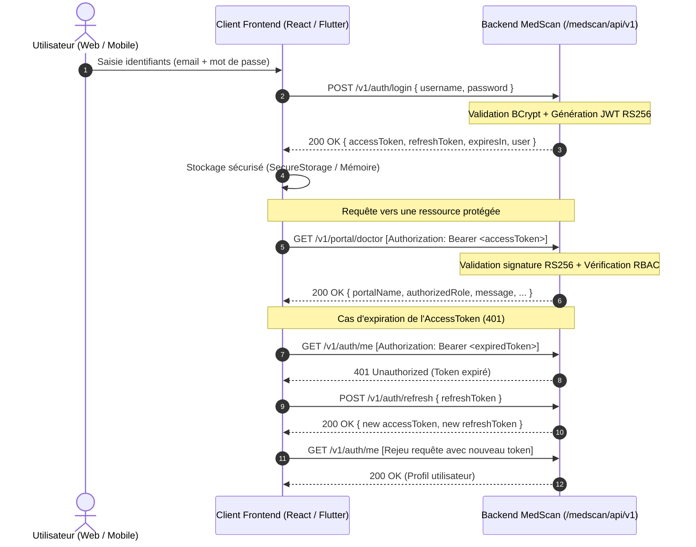

# Guide d'Intégration Frontend & Mobile — MedScan Enterprise

**Statut du document** : `[APPROUVÉ / PRÊT POUR DÉVELOPPEMENT FRONTEND]`  
**Version** : `1.0.0`  
**Date** : 2026-09-26  
**Audience** : Développeurs Frontend Web (React, Next.js, Vue, Angular) & Mobile (Flutter, React Native)  
**Standards Internationaux de Référence** :
- **OpenAPI Specification 3.1.0**
- **RFC 7519** : JSON Web Token (JWT)
- **RFC 6750** : The OAuth 2.0 Authorization Framework: Bearer Token Usage
- **RFC 7807** : Problem Details for HTTP APIs (Gestion standardisée des erreurs)
- **OWASP API Security Top 10** (Stockage sécurisé, rotation des tokens, RBAC)
- **CORS W3C Recommendation**

---

## 1. Informations de Connexion & Environnements

### 1.1 Base URL
Le préfixe standard de l'API est `/medscan/api/v1`.

| Environnement | URL de Base | Description |
| :--- | :--- | :--- |
| **Local (Eclipse)** | `http://localhost:8080/medscan/api` | Serveur local tournant sur la machine de développement |
| **Tunnel Public (Ngrok)** | `https://<votre-id>.ngrok-free.app/medscan/api` | Accès direct HTTPS pour tests immédiats sans déploiement |
| **Recette Cloud (Render/Railway)** | `https://medscan-backend.onrender.com/medscan/api` | Serveur d'intégration continue hébergé en ligne |
| **Production Dédiée** | `https://api.medscan.org/medscan/api` | Infrastructure de production souveraine haute sécurité |

> **Note de tolérance d'URL** : Le backend MedScan intègre un normaliseur d'URL automatique qui tolère indifféremment les requêtes avec ou sans préfixe `/medscan/api` (ex: `/medscan/api/v1/health` ou `/v1/health`).

### 1.2 Configuration des Variables d'Environnement Frontend

#### Pour Web (React / Next.js / Vite) : `.env`
```env
# URL de l'API MedScan (ajuster selon votre cible)
VITE_API_BASE_URL=https://<votre-domaine-ou-ngrok>/medscan/api
VITE_API_TIMEOUT=15000
```

#### Pour Flutter : `lib/config/environment.dart`
```dart
class Environment {
  static const String apiBaseUrl = String.fromEnvironment(
    'API_BASE_URL',
    defaultValue: 'https://<votre-domaine-ou-ngrok>/medscan/api',
  );
  static const int connectTimeoutMs = 15000;
  static const int receiveTimeoutMs = 15000;
}
```

---

## 2. Architecture de Sécurité & Flux d'Authentification

MedScan Enterprise applique une architecture **Zero Trust**. Chaque requête vers une ressource protégée doit fournir un jeton Bearer JWT valide signé en RS256.



---

## 3. Matrice des Acteurs & Comptes de Test (Seed Data)

Tous les comptes ci-dessous sont préconfigurés dans le backend avec le mot de passe : **`Password123!`**

| Rôle | Identifiant / Email | Portail Dédié | Permissions Clés |
| :--- | :--- | :--- | :--- |
| **PATIENT** | `patient@medscan.org` | `/v1/portal/patient` | `health_record:read`, `prescription:read` |
| **DOCTOR** | `doctor@medscan.org` | `/v1/portal/doctor` | `patient:read`, `consultation:write`, `prescription:write` |
| **PHARMACIST** | `pharmacist@medscan.org` | `/v1/portal/pharmacist` | `prescription:dispense`, `stock:read`, `stock:write` |
| **RADIOLOGIST** | `radiologist@medscan.org` | `/v1/portal/radiologist` | `imaging:read`, `imaging:write`, `ai_analysis:execute` |
| **NURSE** | `nurse@medscan.org` | `/v1/portal/nurse` | `patient:read`, `vitals:write`, `care:execute` |
| **LAB_TECHNICIAN** | `labtech@medscan.org` | `/v1/portal/lab-technician` | `lab:order:read`, `lab:result:write` |
| **DELIVERY_AGENT** | `delivery@medscan.org` | `/v1/portal/delivery` | `delivery:accept`, `delivery:update`, `gps:stream` |
| **TENANT_ADMIN** | `tenantadmin@medscan.org` | `/v1/portal/tenant-admin` | `tenant:users:manage`, `audit:read` |
| **SUPER_ADMIN** | `superadmin@medscan.org` | `/v1/portal/super-admin` | `*` (Plein pouvoir plateforme) |
| **AUDITOR** | `auditor@medscan.org` | `/v1/portal/auditor` | `audit:read`, `compliance:report` |

---

## 4. Spécification Détaillée des Endpoints

### 4.1 Health Check (Sonde de vie)
Vérifie la disponibilité du backend sans authentification.

- **Méthode** : `GET`
- **Chemin** : `/v1/health`
- **Authentification requise** : Aucune
- **Réponse Succès (200 OK)** :
```json
{
  "status": "UP"
}
```

---

### 4.2 Connexion & Authentification
Authentifie un acteur et retourne le couple de jetons JWT (Access + Refresh) ainsi que le profil utilisateur.

- **Méthode** : `POST`
- **Chemin** : `/v1/auth/login`
- **En-têtes** : `Content-Type: application/json`
- **Corps de Requête** :
```json
{
  "username": "doctor@medscan.org",
  "password": "Password123!"
}
```

- **Réponse Succès (200 OK)** :
```json
{
  "accessToken": "eyJhbGciOiJSUzI1NiIsInR5cCI6IkpXVCJ9...",
  "refreshToken": "eyJhbGciOiJSUzI1NiIsInR5cCI6IkpXVCJ9...",
  "tokenType": "Bearer",
  "expiresIn": 900,
  "user": {
    "id": "10000000-0000-0000-0000-000000000002",
    "username": "doctor@medscan.org",
    "email": "doctor@medscan.org",
    "displayName": "Dr. Aminata Diallo",
    "tenantId": "00000000-0000-0000-0000-000000000001",
    "tenantCode": "CLINIQUE-OUAGA-1",
    "roles": ["DOCTOR"],
    "permissions": [
      "patient:read",
      "consultation:write",
      "prescription:write"
    ]
  }
}
```

- **Réponse Erreur (401 Unauthorized)** : Conforme RFC 7807
```json
{
  "type": "https://medscan.org/errors/unauthorized",
  "title": "Échec d'authentification",
  "status": 401,
  "detail": "Identifiants invalides pour l'utilisateur: doctor@medscan.org"
}
```

---

### 4.3 Profil Courant de l'Acteur Connecté
Retourne les données d'identité et les habilitations de l'acteur déduites du token Bearer.

- **Méthode** : `GET`
- **Chemin** : `/v1/auth/me`
- **En-têtes** : `Authorization: Bearer <accessToken>`
- **Réponse Succès (200 OK)** :
```json
{
  "id": "10000000-0000-0000-0000-000000000002",
  "username": "doctor@medscan.org",
  "email": "doctor@medscan.org",
  "displayName": "Dr. Aminata Diallo",
  "tenantId": "00000000-0000-0000-0000-000000000001",
  "tenantCode": "CLINIQUE-OUAGA-1",
  "roles": ["DOCTOR"],
  "permissions": [
    "patient:read",
    "consultation:write",
    "prescription:write"
  ]
}
```

---

### 4.4 Rafraîchissement de Token (Refresh)
Permet d'obtenir un nouvel `accessToken` sans redemander la saisie du mot de passe à l'utilisateur.

- **Méthode** : `POST`
- **Chemin** : `/v1/auth/refresh`
- **Corps de Requête** :
```json
{
  "refreshToken": "eyJhbGciOiJSUzI1NiIsInR5cCI6IkpXVCJ9..."
}
```

- **Réponse Succès (200 OK)** :
```json
{
  "accessToken": "eyJhbGciOiJSUzI1NiIsInR5cCI6IkpXVCJ9...",
  "refreshToken": "eyJhbGciOiJSUzI1NiIsInR5cCI6IkpXVCJ9...",
  "tokenType": "Bearer",
  "expiresIn": 900,
  "user": {
    "id": "10000000-0000-0000-0000-000000000002",
    "username": "doctor@medscan.org",
    "email": "doctor@medscan.org",
    "displayName": "Dr. Aminata Diallo",
    "tenantId": "00000000-0000-0000-0000-000000000001",
    "tenantCode": "CLINIQUE-OUAGA-1"
  }
}
```

---

### 4.5 Portails Métier avec Contrôle RBAC
Accès aux espaces spécifiques selon le rôle de l'acteur connecté.

- **Méthode** : `GET`
- **Chemins** :
  - `/v1/portal/patient` (Réservé au rôle `PATIENT`)
  - `/v1/portal/doctor` (Réservé au rôle `DOCTOR`)
  - `/v1/portal/pharmacist` (Réservé au rôle `PHARMACIST`)
  - `/v1/portal/radiologist` (Réservé au rôle `RADIOLOGIST`)
  - `/v1/portal/nurse` (Réservé au rôle `NURSE`)
  - `/v1/portal/lab-technician` (Réservé au rôle `LAB_TECHNICIAN`)
  - `/v1/portal/delivery` (Réservé au rôle `DELIVERY_AGENT`)
  - `/v1/portal/tenant-admin` (Réservé au rôle `TENANT_ADMIN`)
  - `/v1/portal/super-admin` (Réservé au rôle `SUPER_ADMIN`)
  - `/v1/portal/auditor` (Réservé au rôle `AUDITOR`)
- **En-têtes** : `Authorization: Bearer <accessToken>`
- **Réponse Succès (200 OK)** :
```json
{
  "portalName": "Portail Médecin",
  "authorizedRole": "DOCTOR",
  "userId": "10000000-0000-0000-0000-000000000002",
  "username": "doctor@medscan.org",
  "tenantId": "00000000-0000-0000-0000-000000000001",
  "message": "Accès autorisé au dossier clinique et aux consultations."
}
```

- **Réponse Erreur d'Habilitation (403 Forbidden)** : Conforme RFC 7807
```json
{
  "type": "https://medscan.org/errors/forbidden",
  "title": "Accès interdit",
  "status": 403,
  "detail": "Vos habilitations ne vous permettent pas d'accéder au Portail Pharmacie d'Officine. Rôle requis: PHARMACIST"
}
```

---

## 5. Modèle Standardisé des Erreurs (RFC 7807 Problem Details)

Toutes les erreurs de l'API MedScan Enterprise suivent strictement la spécification standard **RFC 7807** :

```typescript
export interface ProblemDetail {
  type: string;     // URI identifiant la catégorie d'erreur
  title: string;    // Résumé court compréhensible pour les humains
  status: number;   // Code HTTP (400, 401, 403, 404, 500, etc.)
  detail: string;   // Explication précise et contextuelle de l'erreur
  instance?: string;// URI de la requête ayant provoqué l'erreur
}
```

---

## 6. Implémentation Client TypeScript / Web (React, Next.js, Vue)

Voici un client HTTP professionnel complet avec gestion automatique des tokens et intercepteur de rafraîchissement (Axios) :

```typescript
// src/api/apiClient.ts
import axios, { AxiosError, AxiosInstance, InternalAxiosRequestConfig } from 'axios';

// 1. Interfaces conformes à l'API
export interface UserProfile {
  id: string;
  username: string;
  email: string;
  displayName: string;
  tenantId: string;
  tenantCode: string;
  roles: string[];
  permissions: string[];
}

export interface AuthResponse {
  accessToken: string;
  refreshToken: string;
  tokenType: string;
  expiresIn: number;
  user: UserProfile;
}

export interface ProblemDetail {
  type: string;
  title: string;
  status: number;
  detail: string;
}

// 2. Création de l'instance Axios
const API_BASE_URL = process.env.VITE_API_BASE_URL || 'http://localhost:8080/medscan/api';

export const apiClient: AxiosInstance = axios.create({
  baseURL: API_BASE_URL,
  timeout: 15000,
  headers: {
    'Content-Type': 'application/json',
    'Accept': 'application/json',
  },
});

// 3. Intercepteur de Requête : Injection automatique du Bearer Token
apiClient.interceptors.request.use(
  (config: InternalAxiosRequestConfig) => {
    const token = localStorage.getItem('medscan_access_token');
    if (token && config.headers) {
      config.headers.Authorization = `Bearer ${token}`;
    }
    return config;
  },
  (error) => Promise.reject(error)
);

// 4. Intercepteur de Réponse : Gestion automatique du Refresh Token sur 401
let isRefreshing = false;
let failedQueue: Array<{ resolve: (token: string) => void; reject: (err: any) => void }> = [];

const processQueue = (error: any, token: string | null = null) => {
  failedQueue.forEach((prom) => {
    if (error) {
      prom.reject(error);
    } else {
      prom.resolve(token!);
    }
  });
  failedQueue = [];
};

apiClient.interceptors.response.use(
  (response) => response,
  async (error: AxiosError<ProblemDetail>) => {
    const originalRequest = error.config as InternalAxiosRequestConfig & { _retry?: boolean };

    // Si erreur 401 et qu'on n'a pas déjà tenté un refresh sur cette requête
    if (error.response?.status === 401 && !originalRequest._retry) {
      if (originalRequest.url?.includes('/v1/auth/login') || originalRequest.url?.includes('/v1/auth/refresh')) {
        return Promise.reject(error);
      }

      if (isRefreshing) {
        return new Promise((resolve, reject) => {
          failedQueue.push({ resolve, reject });
        })
          .then((token) => {
            if (originalRequest.headers) {
              originalRequest.headers.Authorization = `Bearer ${token}`;
            }
            return apiClient(originalRequest);
          })
          .catch((err) => Promise.reject(err));
      }

      originalRequest._retry = true;
      isRefreshing = true;

      const refreshToken = localStorage.getItem('medscan_refresh_token');
      if (!refreshToken) {
        logoutUser();
        return Promise.reject(error);
      }

      try {
        const { data } = await axios.post<AuthResponse>(`${API_BASE_URL}/v1/auth/refresh`, {
          refreshToken,
        });

        localStorage.setItem('medscan_access_token', data.accessToken);
        localStorage.setItem('medscan_refresh_token', data.refreshToken);

        if (originalRequest.headers) {
          originalRequest.headers.Authorization = `Bearer ${data.accessToken}`;
        }
        processQueue(null, data.accessToken);
        return apiClient(originalRequest);
      } catch (refreshError) {
        processQueue(refreshError, null);
        logoutUser();
        return Promise.reject(refreshError);
      } finally {
        isRefreshing = false;
      }
    }

    return Promise.reject(error);
  }
);

export function logoutUser() {
  localStorage.removeItem('medscan_access_token');
  localStorage.removeItem('medscan_refresh_token');
  localStorage.removeItem('medscan_user');
  window.location.href = '/login';
}

// 5. Fonctions d'API prêtes à l'emploi
export const MedscanApi = {
  // Health
  checkHealth: async () => {
    const res = await apiClient.get<{ status: string }>('/v1/health');
    return res.data;
  },

  // Login
  login: async (username: string, password: string): Promise<AuthResponse> => {
    const res = await apiClient.post<AuthResponse>('/v1/auth/login', { username, password });
    localStorage.setItem('medscan_access_token', res.data.accessToken);
    localStorage.setItem('medscan_refresh_token', res.data.refreshToken);
    localStorage.setItem('medscan_user', JSON.stringify(res.data.user));
    return res.data;
  },

  // Obtenir le profil
  getMe: async (): Promise<UserProfile> => {
    const res = await apiClient.get<UserProfile>('/v1/auth/me');
    return res.data;
  },

  // Accéder à un portail spécifique
  getPortal: async (portalSlug: string) => {
    const res = await apiClient.get(`/v1/portal/${portalSlug}`);
    return res.data;
  },
};
```

---

## 7. Implémentation Client Dart / Flutter (Mobile)

Voici l'implémentation complète pour application Flutter avec `dio` et `flutter_secure_storage` (recommandation de sécurité OWASP pour le chiffrement matériel des tokens) :

```yaml
# pubspec.yaml
dependencies:
  flutter:
    sdk: flutter
  dio: ^5.4.0
  flutter_secure_storage: ^9.0.0
```

```dart
// lib/services/api_client.dart
import 'dart:convert';
import 'package:dio/dio.dart';
import 'package:flutter_secure_storage/flutter_secure_storage.dart';

class ApiClient {
  static final ApiClient _instance = ApiClient._internal();
  factory ApiClient() => _instance;

  late final Dio dio;
  final FlutterSecureStorage _storage = const FlutterSecureStorage();
  
  // URL de base vers le serveur MedScan
  static const String baseUrl = 'https://<votre-domaine-ou-ngrok>/medscan/api';

  ApiClient._internal() {
    dio = Dio(
      BaseOptions(
        baseUrl: baseUrl,
        connectTimeout: const Duration(seconds: 15),
        receiveTimeout: const Duration(seconds: 15),
        headers: {
          'Content-Type': 'application/json',
          'Accept': 'application/json',
        },
      ),
    );

    // Ajout de l'intercepteur de sécurité
    dio.interceptors.add(
      InterceptorsWrapper(
        onRequest: (options, handler) async {
          // Injection automatique du token d'accès
          final accessToken = await _storage.read(key: 'access_token');
          if (accessToken != null) {
            options.headers['Authorization'] = 'Bearer $accessToken';
          }
          return handler.next(options);
        },
        onError: (DioException error, handler) async {
          // Interception de l'expiration du token (401)
          if (error.response?.statusCode == 401) {
            final isLoginRequest = error.requestOptions.path.contains('/v1/auth/login');
            final isRefreshRequest = error.requestOptions.path.contains('/v1/auth/refresh');

            if (!isLoginRequest && !isRefreshRequest) {
              final refreshed = await _refreshToken();
              if (refreshed) {
                // Rejeu automatique de la requête d'origine avec le nouveau token
                final newAccessToken = await _storage.read(key: 'access_token');
                error.requestOptions.headers['Authorization'] = 'Bearer $newAccessToken';
                
                final response = await dio.fetch(error.requestOptions);
                return handler.resolve(response);
              }
            }
          }
          return handler.next(error);
        },
      ),
    );
  }

  // Renouvellement transparent du token
  Future<bool> _refreshToken() async {
    final refreshToken = await _storage.read(key: 'refresh_token');
    if (refreshToken == null) return false;

    try {
      final refreshDio = Dio(BaseOptions(baseUrl: baseUrl));
      final response = await refreshDio.post('/v1/auth/refresh', data: {
        'refreshToken': refreshToken,
      });

      if (response.statusCode == 200) {
        final data = response.data;
        await _storage.write(key: 'access_token', value: data['accessToken']);
        await _storage.write(key: 'refresh_token', value: data['refreshToken']);
        return true;
      }
    } catch (_) {
      await logout();
    }
    return false;
  }

  // Authentification
  Future<Map<String, dynamic>> login(String username, String password) async {
    final response = await dio.post('/v1/auth/login', data: {
      'username': username,
      'password': password,
    });

    final data = response.data;
    await _storage.write(key: 'access_token', value: data['accessToken']);
    await _storage.write(key: 'refresh_token', value: data['refreshToken']);
    await _storage.write(key: 'user_profile', value: jsonEncode(data['user']));
    return data;
  }

  // Consultation du profil
  Future<Map<String, dynamic>> getMe() async {
    final response = await dio.get('/v1/auth/me');
    return response.data;
  }

  // Accès portail métier
  Future<Map<String, dynamic>> getPortal(String portalSlug) async {
    final response = await dio.get('/v1/portal/$portalSlug');
    return response.data;
  }

  // Déconnexion
  Future<void> logout() async {
    await _storage.deleteAll();
  }
}
```

---

## 8. Bonnes Pratiques & Recommandations OWASP pour le Frontend

1. **Ne jamais stocker de tokens JWT dans `localStorage` pour les données hautement sensibles en production** si l'application est exposée au risque XSS. Pour les architectures web critiques, privilégiez le stockage des tokens de rafraîchissement dans des cookies `HttpOnly; Secure; SameSite=Strict` ou utilisez un proxy BFF (Backend-For-Frontend).
2. **Sur Flutter / Mobile**, utilisez obligatoirement `flutter_secure_storage` qui exploite le **Keychain (iOS)** et la **KeyStore (Android)** chiffrés par puce matérielle.
3. **Gestion des Rôles côté UI** : Ne vous fiez pas uniquement au masquage d'éléments visuels. Même si un bouton n'est pas affiché, le backend rejettera systématiquement l'appel API avec un code HTTP **403 Forbidden** si le rôle n'est pas adéquat.
4. **Gestion du mode hors-ligne (Offline-First)** : En prévision du réseau mobile dégradé (Afrique de l'Ouest), prévoyez une mise en cache locale (Hive / SQLite) des profils et ordonnances consultés.
